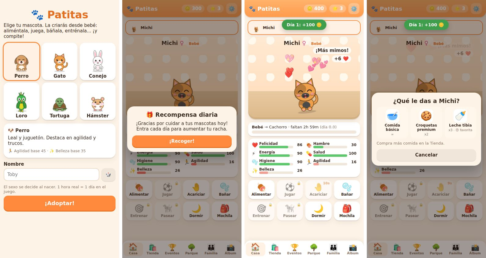
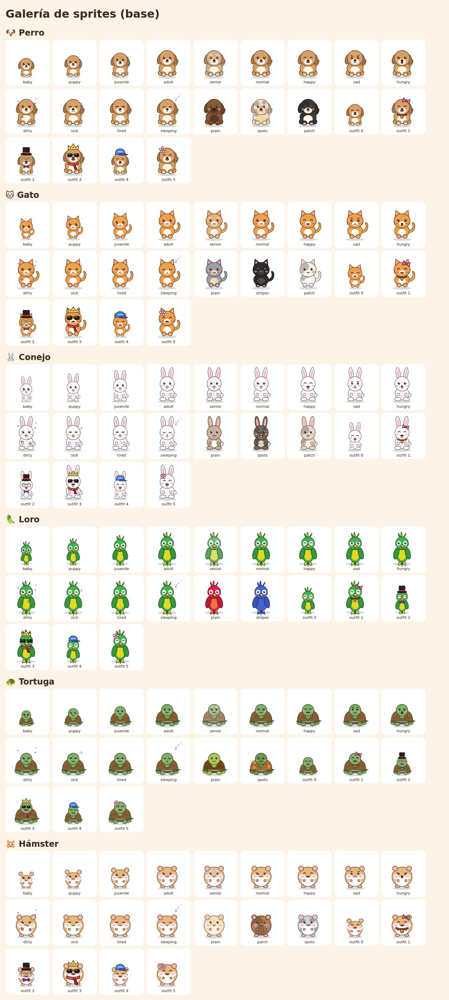

# 🐾 Patitas — juego de mascota virtual (nombre provisional)

Juego 2D de mascota virtual para Android: eliges un animal, lo crías desde bebé, lo cuidas,
lo entrenas, compites en eventos, tienes crías y socializas en el parque.

**Tecnología:** TypeScript + Vite (web) empaquetado como app nativa de Android con **Capacitor**.
Se eligió en lugar de Unity porque permite iterar mucho más rápido, pesa poco (~120 KB de código)
y se prueba en cualquier navegador. La arquitectura respeta el diseño original pensado para Unity
(ver tabla de equivalencias abajo), así que la lógica se puede portar a C# si algún día hace falta.



## Cómo probarlo

```bash
cd mascota-virtual
npm install
npm run dev          # abre http://localhost:5173 (en el móvil: usa la IP que muestra Vite)
npm test             # 23 tests de la lógica
```

- Galería de todos los sprites: `http://localhost:5173/sprites.html`
- En ⚙️ Ajustes → "🧪 Herramientas de prueba" puedes adelantar el tiempo o darte monedas
  (**quitar antes de publicar**).

## Cómo generar el APK de Android

**Opción A — GitHub Actions (sin instalar nada):** cada push que toque `mascota-virtual/` ejecuta
`.github/workflows/android-apk.yml`, que pasa los tests y compila un APK de depuración.
Se descarga en GitHub → pestaña *Actions* → la ejecución → *Artifacts* → `patitas-debug-apk`.

**Opción B — local (con Android Studio):**

```bash
npm run android:sync   # compila la web y la copia al proyecto android/
npm run android:open   # abre Android Studio → Run ▶ o Build → Build APK
```

Para publicar en Google Play hace falta un APK/AAB **firmado** con tu keystore (Build → Generate Signed Bundle).

## Sistemas implementados

| Sistema | Archivo | Qué hace |
|---|---|---|
| **PetSystem** | `src/systems/pet/Pet.ts`, `PetManager.ts`, `PetTypes.ts` | Clase `Pet`, enums `Species`/`Sex`/`GrowthStage`, stats 0-100, degradación con el tiempo, rutina de sueño propia (se duerme sola con poca energía y se despierta al descansar), escape con salud 0 y rescate en 48 h (búsqueda con probabilidad creciente o Collar GPS). Nunca muere. Nombre personalizado o aleatorio, renombrable. |
| **GrowthSystem** | `src/systems/growth/GrowthSystem.ts`, `src/data/stages.ts` | 5 etapas (Bebé 0-3, Cachorro 3-7, Juvenil 7-14, Adulto 14+, Senior 45+), desbloqueos por etapa, barra de progreso, +10 % a stats base si fue bien cuidado (media ≥ 70), 1 h real = 1 día, aceleradores. |
| **InteractionSystem** | `src/systems/interaction/InteractionSystem.ts`, `src/data/actions.ts` | Alimentar (elige comida), jugar, bañar, entrenar trucos y pasear con botones flotantes; acariciar tocando a la mascota. Si duerme, tocarla la despierta y pierde felicidad. Cooldowns, energía mínima, monedas al azar, animación + partículas + textos flotantes. |
| **EconomySystem** | `src/systems/economy/EconomySystem.ts`, `src/data/items.ts` | Monedas y Estrellas, tienda (comida, accesorios, muebles, aceleradores, medicina, especiales), inventario, accesorios visibles en la mascota, muebles con bonus pasivos, recompensa diaria con racha. |
| **EventSystem** | `src/systems/competition/EventSystem.ts`, `src/ui/minigames/Minigames.ts` | Solo adultos. Carrera de agilidad (saltar obstáculos), concurso de belleza (pasarela con timing), show de trucos (memoria). Nota = stats + minijuego, 1-5 estrellas, recompensas y ranking. |
| **BreedingSystem** | `src/systems/breeding/BreedingSystem.ts`, `AdoptionService.ts` | Adultos de la misma especie y sexo opuesto (tuyos o de otros jugadores, simulados). Herencia de color, patrón, tamaño y stats con mutación. Máx. 3 en casa, resto al rancho. Adopción pública de crías. |
| **SaveSystem** | `src/systems/save/SaveSystem.ts`, `AlbumSystem.ts`, `Storage.ts` | Guardado JSON automático (Capacitor Preferences en Android), tiempo offline simulado con resumen "Mientras no estabas...", migración de versiones, copia de seguridad, álbum de recuerdos con "foto" de cada momento. |
| **Parque** | `src/systems/park/ParkService.ts` | Visitantes simulados para saludar. Interfaz `ParkNetwork` lista para conectar el multijugador real. |

## Equivalencias con el diseño para Unity

| Pedido (Unity) | Aquí |
|---|---|
| ScriptableObjects de especies/items | Definiciones de datos en `src/data/*.ts` registradas en `DataRegistry` |
| Patrón Singleton en managers | `static get instance()` en cada manager/sistema |
| C# events | `EventBus` tipado (`src/core/EventBus.ts`) |
| MonoBehaviour `Update()` | `GameManager.tick()` cada segundo |
| PlayerPrefs / JSON | `SaveSystem` + `Storage` (Preferences / localStorage) |

## Cómo ampliar el juego

- **Nueva especie:** añade su definición en `src/data/species.ts` y una función de dibujo en `src/sprites/PetSprite.ts` (`DRAWERS`).
- **Nuevo item:** añádelo en `src/data/items.ts`. Si es accesorio, dibújalo en `src/sprites/Accessories.ts` con el mismo id.
- **Nueva competencia:** añádela en `src/data/competitions.ts`; si necesita otro minijuego, regístralo en `MINIGAMES`.
- **Balance:** todos los números (degradación, salud, precios de crianza, tiempos...) están en `src/core/GameConfig.ts`.

## Sprites

Los sprites son **originales y se generan por código en SVG** (`src/sprites/`): cambian de color y
patrón según los genes, de proporciones según la etapa (los bebés son cabezones), de expresión según
el estado de ánimo y llevan los accesorios puestos. Son una base: si se quieren sprites dibujados a mano,
solo hay que reemplazar `renderPetSVG`.



## Pendiente / siguiente paso

- Multijugador online real (parque, adopción y parejas entre jugadores): necesita un backend (p. ej. Firebase o Supabase).
- Notificaciones locales en Android ("¡tu mascota tiene hambre!").
- Sonidos y música.
- Icono y pantalla de carga propios, nombre definitivo del juego.
- Firmado y publicación en Google Play.
